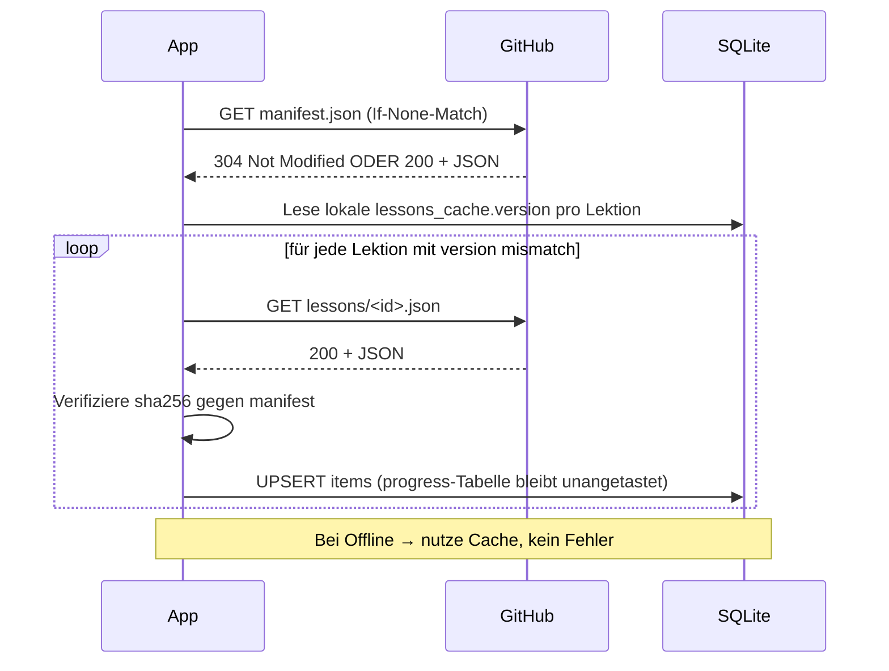
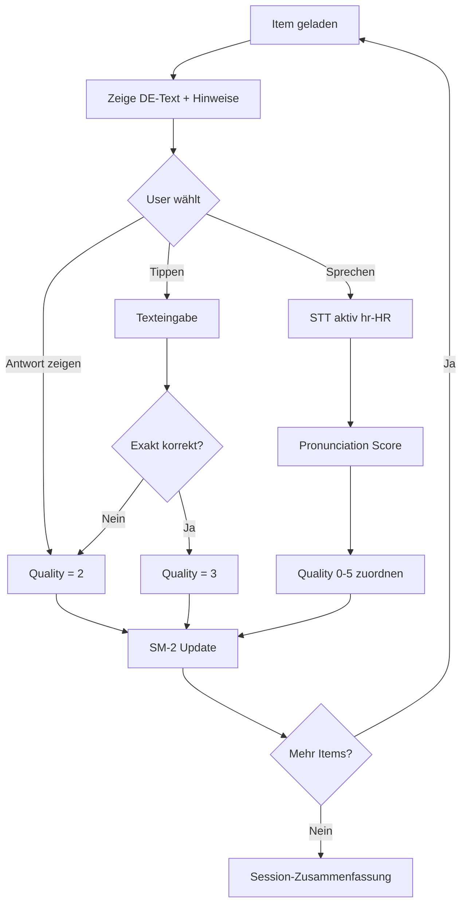

# vocabularies-kroatic

> Vokabeltrainer Deutsch ↔ Kroatisch mit Spaced Repetition, Spracherkennung
> und Aussprachebewertung. Fokus auf praxistauglichem Reise-Wortschatz.
> Endprodukt: native Android-App (APK) auf Basis von Flutter.

**Status:** Produktiv — App **v1.0.65**, lauffähige Release-APK, 12 Lektionen mit
~1.622 Items. Roadmap-Phasen 1–3 weitgehend umgesetzt, zahlreiche Features darüber
hinaus geliefert (siehe §12). Stand 2026-05-29.

---

## Inhaltsverzeichnis

1. [Projektüberblick](#1-projektüberblick)
2. [Lernkonzept & Didaktik](#2-lernkonzept--didaktik)
3. [Inhaltsquellen & Lizenzen — woher kommen die Vokabeln?](#3-inhaltsquellen--lizenzen)
4. [Externes Datenschema (JSON)](#4-externes-datenschema-json)
5. [Tech-Stack & Architektur](#5-tech-stack--architektur)
6. [Datenmodell lokal (Drift / SQLite)](#6-datenmodell-lokal-drift--sqlite)
7. [Spaced-Repetition-Algorithmus (SM-2)](#7-spaced-repetition-algorithmus-sm-2)
8. [Sprach-Features (STT, TTS, Aussprachebewertung)](#8-sprach-features)
9. [App-Flows & Screens](#9-app-flows--screens)
10. [Projektstruktur](#10-projektstruktur)
11. [Build & Release (Android APK)](#11-build--release-android-apk)
12. [Roadmap](#12-roadmap)
13. [Anhang: Glossar & Referenzen](#13-anhang)

---

## 1. Projektüberblick

### Ziel

Eine **native Android-App** (per Flutter cross-platform-fähig), die kroatische
Vokabeln und Sätze nach einem didaktisch aufgebauten Lehrplan trainiert.
Inhalte werden über ein **versioniertes JSON-Repository** ausgeliefert; die
App funktioniert offline, sobald eine Lektion einmal geladen wurde.

### Zielgruppe

Deutschsprachige Erwachsene, die Kroatisch für **Reise, Urlaub und
Smalltalk** lernen wollen — kein Schulkontext, kein akademisches Niveau.

### Kern-Features

| Feature | Beschreibung |
|---|---|
| Thematische Lektionen | 8 initiale Themen (Begrüßung … Tourismus) mit Progression Wort → Wortgruppe → Satz |
| Spaced Repetition | SM-2-Algorithmus für nachhaltige Memorierung |
| Spracheingabe (STT) | `speech_to_text` mit `hr-HR`-Locale; vergleicht Sprecheingabe mit Zielwort |
| Sprachausgabe (TTS) | `flutter_tts` spricht jede Vokabel auf Knopfdruck vor |
| Aussprachebewertung | Levenshtein-basiertes Scoring mit Diakritika-aware Normalisierung |
| Fehlerfokus-Modus | Top-N schwierigster Items wird separat trainiert |
| Externe Daten | App-Update entkoppelt von Vokabel-Update (JSON via GitHub Raw) |
| Offline-fähig | Nach erstem Lektions-Download voll funktionsfähig ohne Internet |

### Erfolgs-Kriterien (Definition of "Fertig")

- APK installierbar auf Android 9+ ohne Play Store
- 3 Lektionen produktiv lauffähig (MVP)
- SR-Progress überlebt App-Restart und Datenupdate
- Spracherkennung erkennt korrekt ausgesprochene Vokabeln mit ≥ 80% Trefferquote
  (subjektive Messung, einzelne Vokabeln, ruhige Umgebung)

---

## 2. Lernkonzept & Didaktik

### 2.1 Progressionsprinzip (Wort → Phrase → Satz)

Eine Lektion besteht aus **drei Stages**, die nacheinander freigeschaltet werden:

```
Stage 1: Einzelwörter         → "Bok" (Hallo), "Hvala" (Danke)
Stage 2: Wortgruppen          → "Dobro jutro" (Guten Morgen)
Stage 3: Kurze Sätze          → "Kako si?" (Wie geht es dir?)
```

Eine Stage gilt als **abgeschlossen**, wenn ≥ 80 % der Items darin einen
SM-2-Ease-Faktor ≥ 2.5 erreicht haben. Erst dann schaltet die App die
nächste Stage frei.

### 2.2 Schwierigkeitsstufen (1–5)

Jedes Item trägt eine `difficulty` von 1 bis 5:

| Stufe | Bedeutung | Beispiel |
|:-:|---|---|
| **1** | Absolute Basis | „Bok", „Da", „Ne", „jedan" |
| **2** | Erweiterte Basis | „Dobrodošli", „Hvala lijepo", Familienbegriffe |
| **3** | Alltagstauglich | „Koliko košta?", einfache Verben im Präsens |
| **4** | Aufbau | „Imate li slobodnu sobu?", komplexere Fragesätze |
| **5** | Fortgeschritten | Konjunktivformen, idiomatische Wendungen |

Diese Stufe wirkt sich auf den **initialen SM-2-Ease-Faktor** aus
(schwierigere Items starten mit kleinerem Faktor → häufigere Wiederholung)
und auf die Sortierung im Lektions-UI.

### 2.3 Thematische Lektionen (MVP-Set)

| # | Lektion | Items (Ziel) | Voraussetzung |
|:-:|---|:-:|---|
| 1 | Begrüßung | 24 | — |
| 2 | Sich vorstellen | 35 | Begrüßung |
| 3 | Zahlen / Uhrzeit | 60 | Begrüßung |
| 4 | Familie | 30 | Sich vorstellen |
| 5 | Einkaufen | 45 | Zahlen |
| 6 | Restaurant | 50 | Zahlen |
| 7 | Verkehr / Wege | 40 | Zahlen |
| 8 | Tourismus | 55 | Verkehr |

Voraussetzungen werden client-seitig durchgesetzt: spätere Lektionen
bleiben gesperrt, bis die Vorgänger ≥ 60 % gelernt sind.

### 2.4 Fehlerfokus-Modus

Jedes Item führt einen Fehler-Quotienten:

```
errorRate = errors / (errors + successes + 1)
```

Der Modus **"Fehlerfokus"** zieht die härtesten Items nach `errorRate`
quer über alle Lektionen und mixt sie zu einer eigenen Session. Ziel: gezielte
Konsolidierung der fehleranfälligsten Stellen.

> **Umsetzungsstand (Iteration 65):** Produktiv als eigener Home-Eintrag
> „🎯 Fehlerfokus" (erscheint nur, wenn es schwierige Vokabeln gibt). Der
> `ErrorFocusBuilder` faltet die `errorRate` lektionsübergreifend und
> **richtungs-agnostisch** aus der `quiz_attempts`-Historie
> (`AppDatabase.itemErrorStats`) und baut über das geteilte
> `buildPoolQuestions` eine Session aus den **10 härtesten** Items — nicht
> „Top-30": die App standardisiert auf 10-Fragen-Sessions, der dedizierte Modus
> fügt sich dort ein, statt eine Sonderlänge einzuführen.

---

## 3. Inhaltsquellen & Lizenzen

> Diese Sektion dokumentiert, **woher die Vokabeldaten stammen** und welche
> rechtlichen Verpflichtungen damit verbunden sind. Sie ist bewusst weit
> vorne im Dokument platziert: die Qualität der App = Qualität der Daten,
> und die CC-BY-Attribution ist eine harte Pflicht.

### 3.1 Primärquellen

| Quelle | Lizenz | Verwendung in diesem Projekt |
|---|---|---|
| [**Tatoeba**](https://tatoeba.org) (DE↔HR) | CC-BY 2.0 | Beispielsätze (gefiltert nach Länge ≤ 8 Wörter, manuell ausgewähltes Subset) |
| **Eigene Kuration** | CC-BY 4.0 | Lektions-Strukturierung, Wortauswahl, Stages, IPA-Transkription |
| [**Anki: Easy-Croatian**](https://ankiweb.net/shared/info/190661393) | Inspiration | Wortauswahl-Referenz (kein Direktimport) |
| [**Anki: 4000 German Words by Frequency**](https://ankiweb.net/shared/info/653061995) | Inspiration | Frequenzheuristik für Wortwahl (kein Direktimport) |
| [**Helsinki-NLP/Tatoeba-Challenge**](https://github.com/Helsinki-NLP/Tatoeba-Challenge) | CC-BY (von Tatoeba) | Vorbereitete Satzpaare als Konvertierungs-Hilfe |
| [**GitHub: matkosoric/Croatian-Language-Dataset**](https://github.com/matkosoric/Croatian-Language-Dataset) | siehe Repo | Referenz für kroatischen Satzbau, kein Direktimport |

**Wichtig:** Anki-Decks werden **nicht direkt importiert**, sondern dienen
ausschließlich als Inspirationsquelle für sinnvolle Wortauswahl.
Übernommene Sätze stammen ausschließlich aus Tatoeba (mit korrekter
Attribution per `license`-Block) oder aus eigener Formulierung.

### 3.2 Tatoeba-Filter-Pipeline

Aus dem Tatoeba-Snapshot wird ein lehrtaugliches Subset extrahiert:

```
1. Download:  links.csv + sentences.csv  (Snapshot von tatoeba.org/en/downloads)
2. Extract:   Sätze mit Sprach-Tag deu ↔ hrv joinen über links
3. Filter:    Länge ≤ 8 Wörter, kein Slang, keine Eigennamen ohne Kontext,
              kein doppelter Satz im selben Bucket
4. Tagging:   Manuelles Tagging in 8 Themen-Buckets (greetings, introduction, ...)
5. Curation:  Auswahl der besten ~30 Sätze pro Bucket nach Lehrwert
6. Export:    Pro Lektion JSON-Datei mit license-Block je übernommenem Satz
```

Die Pipeline-Skripte liegen unter `tools/tatoeba-import/`
(Python 3, `tatoeba_filter.py` + `lesson_export.py`). Aus dem Output
befüllt der Maintainer dann die Lektionsdateien im Daten-Repo manuell
mit der finalen Auswahl — Tatoeba liefert das Rohmaterial, der Maintainer
trifft die didaktische Entscheidung.

### 3.3 Attribution-Mechanismus

Jede aus Tatoeba übernommene Vokabel/Satz trägt einen `license`-Block:

```jsonc
"license": {
  "sourceId": "tatoeba-cc-by-2.0",
  "sentenceIdDe": 1234567,
  "sentenceIdHr": 7654321,
  "contributors": ["user_xyz"]
}
```

In der App ist unter **Einstellungen → Lizenzen** eine vollständige
Attributionsliste sichtbar, die zur Laufzeit aus allen `license`-Blocks
und der Sammeldatei `licenses/attribution.json` aggregiert wird.

Eigenkuriete Items tragen `"license": null` und unterliegen damit
automatisch der Repo-Lizenz **CC-BY 4.0**.

### 3.4 Datenrepository (Trennung App ↔ Daten)

Die Daten liegen in einem **separaten GitHub-Repo**:

```
https://github.com/mfred/vocabularies-kroatic-data
```

**Begründung der Repo-Trennung:**

- Das App-Repo bleibt schlank (Code-Reviews fokussieren auf Code)
- Inhalts-Updates (neue Vokabeln) triggern keinen App-Rebuild und keinen
  Play-Store-Update-Roundtrip
- Daten-Mitarbeit ist niedrigschwelliger als Code-Mitarbeit (PR auf eine
  JSON-Datei statt Dart-Patch)
- Versionierung der Inhalte ist unabhängig vom App-Release-Zyklus

Die App lädt zur Laufzeit:

```
https://raw.githubusercontent.com/mfred/vocabularies-kroatic-data/main/v1/manifest.json
```

und folgt von dort auf die einzelnen Lektionsdateien (siehe §4.5).

---

## 4. Externes Datenschema (JSON)

### 4.1 Verzeichnisstruktur des Daten-Repos

```
vocabularies-kroatic-data/
├── README.md
├── CHANGELOG.md
├── SCHEMA.md                ← vollständige Feld-Doku für Contributor
├── LICENSE                  ← CC-BY 4.0
├── v1/
│   ├── manifest.json        ← Index mit Versionen + SHA256
│   └── lessons/
│       ├── greetings.json
│       ├── introduction.json
│       ├── numbers-time.json
│       ├── family.json
│       ├── shopping.json
│       ├── restaurant.json
│       ├── traffic.json
│       └── tourism.json
└── licenses/
    └── attribution.json     ← aggregierte CC-BY-Attribution
```

Die Top-Level-Versionierung `v1/` erlaubt einen späteren Breaking-Change
auf `v2/`, ohne Alt-Clients zu beschädigen — die Alt-Daten bleiben unter
`v1/` weiterhin erreichbar.

### 4.2 manifest.json (Vollbeispiel siehe Daten-Repo)

```jsonc
{
  "schemaVersion": "1.0.0",
  "dataVersion":   "2026-05-16",
  "generatedAt":   "2026-05-16T00:00:00Z",
  "baseUrl":       "https://raw.githubusercontent.com/mfred/vocabularies-kroatic-data/main/v1/",
  "languages":     { "source": "de-DE", "target": "hr-HR" },
  "lessons": [
    {
      "id":             "greetings",
      "version":        "1.0.0",
      "title":          { "de": "Begrüßung", "hr": "Pozdrav" },
      "order":          1,
      "difficulty":     1,
      "wordCount":      12,
      "phraseCount":    6,
      "sentenceCount":  6,
      "prerequisites":  [],
      "tags":           ["basics", "social"],
      "file":           "lessons/greetings.json",
      "sha256":         "<filled-by-build>",
      "sizeBytes":      0
    }
  ],
  "globalLicenses": [
    { "id": "tatoeba-cc-by-2.0", "name": "Tatoeba Project", "url": "https://tatoeba.org",
      "license": "CC-BY 2.0",
      "licenseUrl": "https://creativecommons.org/licenses/by/2.0/" }
  ]
}
```

### 4.3 Lektionsdatei

```jsonc
{
  "schemaVersion": "1.0.0",
  "lessonId":      "greetings",
  "version":       "1.0.0",
  "title":         { "de": "Begrüßung", "hr": "Pozdrav" },
  "stages": [
    { "id": "words",     "type": "vocabulary", "label": { "de": "Einzelwörter" } },
    { "id": "phrases",   "type": "phrase",     "label": { "de": "Wortgruppen" } },
    { "id": "sentences", "type": "sentence",   "label": { "de": "Sätze" } }
  ],
  "items": [
    {
      "id":          "greet_001",
      "type":        "word",
      "stage":       "words",
      "difficulty":  1,
      "de":          { "text": "Hallo", "pos": "interjection" },
      "hr":          { "text": "Bok", "ipa": "bok", "pos": "interjection" },
      "alternatives":{ "hr": ["Zdravo"] },
      "tags":        ["informal", "greeting"],
      "notes":       { "de": "Informelle Begrüßung." },
      "license":     null
    },
    {
      "id":          "greet_201",
      "type":        "sentence",
      "stage":       "sentences",
      "difficulty":  2,
      "requires":    ["greet_001"],
      "de":          { "text": "Wie geht es dir?" },
      "hr":          { "text": "Kako si?", "ipa": "ˈkako si" },
      "wordRefs":    ["greet_001"],
      "tags":        ["question", "smalltalk"],
      "license":     null
    }
  ]
}
```

**Feldbedeutung:**

| Feld | Zweck |
|---|---|
| `type` | `word` \| `phrase` \| `sentence` — steuert das Trainings-UI |
| `stage` | Progressionsstufe (matcht `stages[].id`) |
| `difficulty` | 1–5, beeinflusst SM-2-Initialfaktor und Sortierung |
| `de` / `hr` als Objekte | erlaubt späteres Hinzufügen von Feldern ohne Schema-Bruch |
| `ipa` optional | für Aussprache-Hinweis und phonetische Levenshtein-Normalisierung |
| `pos` (part of speech) | Filter, optionaler Grammatik-Hinweis im UI |
| `alternatives` | akzeptierte Synonyme bei STT-/Tipp-Eingabe |
| `requires` | Pflicht-Vorgänger-IDs (z.B. Satz benötigt vorher gelernte Wörter) |
| `wordRefs` | Verweise auf Wort-Items für Detail-Pages |
| `license` | nur gesetzt bei externer Quelle; `null` = eigenkuriert (CC-BY 4.0) |

### 4.4 Versionierungsregeln

| Änderungstyp | Bumpt |
|---|---|
| Neuer Eintrag in Lektion | Lektion: PATCH (`1.3.0` → `1.3.1`) |
| Inhaltliche Korrektur (Typo, IPA) | Lektion: PATCH |
| Neue Beispielsätze, neue Stage | Lektion: MINOR (`1.3.1` → `1.4.0`) |
| Entfernen/Umstrukturieren | Lektion: MAJOR (`1.4.0` → `2.0.0`) |
| Schema-Erweiterung (rückwärtskompatibel) | `manifest.schemaVersion`: MINOR |
| Schema-Bruch | Neuer Top-Level-Pfad `v2/` |

**IDs sind unveränderlich.** Wird ein Eintrag gelöscht, bleibt die ID
„verbrannt" — der Client ignoriert Progress-Einträge zu unbekannten IDs,
recycelt sie aber nicht. Das schützt User-Fortschritt vor Verwirrung
nach Daten-Refactors.

### 4.5 Client-Update-Flow



---

## 5. Tech-Stack & Architektur

### 5.1 Komponenten-Übersicht

```
┌─────────────────────────────────────────────────────────┐
│                  Flutter App (Dart)                     │
├─────────────────────────────────────────────────────────┤
│  UI Layer (Material 3)                                  │
│    ├── Lesson Browser    ├── Training Session           │
│    └── Fehlerfokus       └── Settings & Stats           │
├─────────────────────────────────────────────────────────┤
│  Business Logic                                         │
│    ├── SM-2 Scheduler    ├── Pronunciation Scorer       │
│    └── Lesson Manager    └── Progress Tracker           │
├─────────────────────────────────────────────────────────┤
│  Platform Bridges                                       │
│    ├── speech_to_text (hr-HR / de-DE)                   │
│    ├── flutter_tts                                      │
│    └── Drift (SQLite)                                   │
├─────────────────────────────────────────────────────────┤
│  Data Sync                                              │
│    └── Dio HTTP Client → GitHub Raw                     │
└─────────────────────────────────────────────────────────┘
```

### 5.2 Bibliothekswahl

| Zweck | Paket | Begründung |
|---|---|---|
| State Management | `flutter_riverpod` | Testbar, kein BuildContext-Zwang |
| SQLite | `drift` | Typsicher, Code-Generation, async-first |
| HTTP | `dio` | Interceptors, ETag-Support einfach |
| STT | `speech_to_text` | hr-HR-Locale-Unterstützung (geräteabhängig) |
| TTS | `flutter_tts` | hr-HR-Stimme auf Android verfügbar |
| JSON | `json_serializable` + `freezed` | Compile-time-safety, immutable Models |
| Logging | `logger` | Strukturierte Logs für Debugging |
| Internationalisierung | `flutter_localizations` | Vorbereitung auf weitere Quellsprachen |

---

## 6. Datenmodell lokal (Drift / SQLite)

### 6.1 Tabellen

```sql
-- Items aus den JSON-Lektionen gespiegelt
CREATE TABLE items (
  id              TEXT PRIMARY KEY,        -- z.B. "greet_001"
  lesson_id       TEXT NOT NULL,
  type            TEXT NOT NULL,           -- word | phrase | sentence
  stage           TEXT NOT NULL,
  difficulty      INTEGER NOT NULL,
  de_text         TEXT NOT NULL,
  de_ipa          TEXT,
  de_pos          TEXT,
  hr_text         TEXT NOT NULL,
  hr_ipa          TEXT,
  hr_pos          TEXT,
  alternatives_hr TEXT,                    -- JSON-Array als String
  tags            TEXT,                    -- JSON-Array als String
  notes_de        TEXT,
  requires        TEXT,                    -- JSON-Array Item-IDs
  license_json    TEXT,                    -- raw JSON oder NULL
  lesson_version  TEXT NOT NULL            -- für Cache-Invalidierung
);

-- User-Progress (Item-Inhalt und Fortschritt physisch getrennt)
CREATE TABLE progress (
  item_id         TEXT PRIMARY KEY REFERENCES items(id),
  ease_factor     REAL NOT NULL DEFAULT 2.5,
  interval_days   INTEGER NOT NULL DEFAULT 0,
  repetitions     INTEGER NOT NULL DEFAULT 0,
  due_date        INTEGER NOT NULL,        -- UNIX-Timestamp
  errors          INTEGER NOT NULL DEFAULT 0,
  successes       INTEGER NOT NULL DEFAULT 0,
  last_reviewed   INTEGER
);

-- Cache-Metadaten pro Lektion
CREATE TABLE lessons_cache (
  lesson_id       TEXT PRIMARY KEY,
  version         TEXT NOT NULL,
  downloaded_at   INTEGER NOT NULL,
  sha256          TEXT NOT NULL
);
```

### 6.2 Wichtige Invariante

`progress` und `items` sind über `item_id` verknüpft, aber **physisch
getrennt**. Wenn ein Lektions-Update Items neu lädt, wird `progress` nie
überschrieben — Lernfortschritt überlebt jeden Daten-Refresh.

---

## 7. Spaced-Repetition-Algorithmus (SM-2)

> **Umsetzungsstand:** Seit Iteration 55 produktiv. Der SM-2-Zustand
> (Ease-Faktor, Intervall, Fälligkeit) wird **nicht persistiert**, sondern bei
> Bedarf deterministisch aus der `quiz_attempts`-Historie gefaltet
> (`Sm2Scheduler` + `AppDatabase.sm2StatesByItem`) — mathematisch äquivalent zu
> einer Progress-Tabelle, aber ohne zweite Quelle der Wahrheit/Migration. SM-2
> treibt sowohl den Home-Eintrag „Fällige Wiederholung" (Iter 55) als auch die
> Frage-Auswahl im regulären Lektions-Quiz (Iter 59).

### 7.1 Warum SM-2?

Bewährt, einfach implementierbar, vergleichbare Resultate mit moderneren
Algorithmen für Vokabel-Lernkurven. Anki nutzt eine SM-2-Variante.

### 7.2 Algorithmus (Dart-Pseudocode)

```dart
// quality: 0..5 (0 = totaler Blackout, 5 = perfekt)
ProgressUpdate sm2(Progress p, int quality) {
  if (quality < 3) {
    return p.copyWith(
      repetitions: 0,
      intervalDays: 1,
      easeFactor: max(1.3, p.easeFactor - 0.2),
    );
  }

  int newReps = p.repetitions + 1;
  int newInterval;
  if (newReps == 1)      newInterval = 1;
  else if (newReps == 2) newInterval = 6;
  else                   newInterval = (p.intervalDays * p.easeFactor).round();

  double newEase = p.easeFactor
      + (0.1 - (5 - quality) * (0.08 + (5 - quality) * 0.02));
  newEase = max(1.3, newEase);

  return p.copyWith(
    repetitions:  newReps,
    intervalDays: newInterval,
    easeFactor:   newEase,
    dueDate:      now() + Duration(days: newInterval),
  );
}
```

### 7.3 Mapping: App-Antwort → SM-2-Quality

| User-Aktion in App | quality |
|---|:-:|
| Spracheingabe perfekt (Pronunciation Score ≥ 0.95) | 5 |
| Spracheingabe gut (≥ 0.80) | 4 |
| Spracheingabe ok / Tippeingabe korrekt (≥ 0.60) | 3 |
| Tippeingabe nach „Antwort zeigen" | 2 |
| Komplett falsch / „weiß nicht" | 0 |

### 7.4 Session-Auswahl

```
1. Hole alle items mit progress.due_date <= today
2. Sortiere nach due_date asc, dann nach errorRate desc
3. Maximal 20 Items pro Session (Burnout-Vermeidung)
4. Wenn weniger als 20 fällig → fülle auf mit neuen Items aus
   freigeschalteten Lektionen (Verhältnis ca. 1 neues Item pro 3 Reviews)
```

---

## 8. Sprach-Features

### 8.1 TTS — Sprachausgabe (`flutter_tts`)

```dart
await tts.setLanguage("hr-HR");
await tts.setSpeechRate(0.45);   // langsamer für Lernende
await tts.setPitch(1.0);
await tts.speak(item.hr.text);
```

Fallback bei fehlender `hr-HR`-Stimme: Hinweis-Dialog mit Link zu den
Android-Sprachpaket-Einstellungen. Optional kann pro Item eine
`audioHint`-URL hinterlegt sein (native Sprecheraufnahme im
Daten-Repo unter `v1/audio/hr/`).

### 8.2 STT — Spracheingabe (`speech_to_text`)

```dart
await stt.listen(
  localeId: "hr_HR",
  onResult: (result) => evaluatePronunciation(
    result.recognizedWords,
    item.hr.text,
  ),
);
```

Wenn der User Deutsch → Kroatisch übt, ist die Listen-Locale `hr_HR`.
Beim umgekehrten Modus (HR → DE) entsprechend `de_DE`.

### 8.3 Aussprachebewertung (Levenshtein)

```dart
double pronunciationScore(String spoken, String target) {
  final a = _normalize(spoken);
  final b = _normalize(target);
  final dist = levenshtein(a, b);
  return 1.0 - dist / max(a.length, b.length);
}

String _normalize(String s) => s
    .toLowerCase()
    .replaceAll(RegExp(r'[.,!?;:]'), '')
    .trim();
```

**Diakritika-Handhabung** (č, ć, š, ž, đ): Die `strict`-Stufe verlangt sie
exakt (perfekte Antwort, kein Hinweis). Seit **Iteration 58** faltet die
**tolerante** Stufe sie jedoch (č/ć→c, š→s, ž→z, đ→d), sodass eine nur durch
fehlende/falsche Akzente abweichende Antwort als richtig **mit
Schreibweise-Hinweis** zählt — Lern-Ergonomie vor orthographischer Strenge.
Multiple Choice bleibt strikt (exakte Option-Auswahl).

**Mapping der Scores → SM-2-Quality** siehe §7.3.

### 8.4 Zukunft (Phase 4+)

Optional Azure Pronunciation Assessment als **Premium-Feature**, weil
deutlich genauer (Phonem-Level-Feedback). Erfordert API-Key,
Datenschutz-Hinweis und ggf. monatliches Kontingent — daher nur als
Opt-In, nicht im MVP.

---

## 9. App-Flows & Screens

### 9.1 Navigations-Hierarchie

```
┌────────────────────┐
│   Home / Dashboard │  ← Heute fällig: X Items, Streak, Empfehlung
└──────────┬─────────┘
           ├──→ Lesson Browser     ← Liste aller Lektionen mit Progress
           │      └─→ Lesson Detail (Items-Liste, Stage-Status)
           │            └─→ Training Session
           ├──→ Daily Review       ← Heute fällige SR-Items
           ├──→ Fehlerfokus        ← 10 schwierigste Items (höchste errorRate)
           └──→ Settings           ← TTS-Speed, Lizenzen, Reset, Daten-Refresh
```

### 9.2 Training-Session-Flow



---

## 10. Projektstruktur

```
vocabularies-kroatic/
├── android/                 ← Android-Build-Konfiguration
├── ios/                     ← (optional, später)
├── lib/
│   ├── main.dart
│   ├── app.dart
│   ├── core/
│   │   ├── database/        ← Drift-Tabellen, DAOs
│   │   ├── network/         ← Manifest-Sync, ETag-Handling
│   │   ├── speech/          ← STT/TTS-Wrapper
│   │   └── utils/           ← Levenshtein, Normalisierung
│   ├── features/
│   │   ├── lessons/         ← UI + Logik Lektionen
│   │   ├── training/        ← Session-Flow
│   │   ├── srs/             ← SM-2-Algorithmus
│   │   ├── error_focus/     ← Schwierige Vokabeln
│   │   └── stats/           ← Dashboard, Streak
│   ├── models/              ← Generated JSON-Models (freezed)
│   └── shared/              ← Widgets, Themes
├── tools/
│   └── tatoeba-import/      ← Python-Skripte für Daten-Pipeline
├── test/                    ← Unit + Widget Tests
├── pubspec.yaml
├── PROJECT.md
├── CHANGELOG.md
└── README.md
```

---

## 11. Build & Release (Android APK)

### 11.1 Voraussetzungen

- Flutter SDK ≥ 3.24.0
- Dart SDK ≥ 3.5.0
- Android SDK + Build-Tools 34
- JDK 17

### 11.2 Erstinitialisierung

```bash
cd /home/user/projects/vocabularies-kroatic
flutter create --org at.token.vocabularies --project-name vocabularies_kroatic \
  --platforms android .
flutter pub get
flutter pub run build_runner build --delete-conflicting-outputs
```

### 11.3 Debug-Build & Live-Run

```bash
flutter run -d <device-id>
```

### 11.4 Unsigned Release-APK (für eigene Geräte / Sideload)

```bash
flutter build apk --release
# Output: build/app/outputs/flutter-apk/app-release.apk
```

### 11.5 Signierter Release-APK

1. Keystore generieren:
   ```bash
   keytool -genkey -v -keystore ~/keys/vocabularies-kroatic.jks \
     -keyalg RSA -keysize 2048 -validity 10000 -alias vk
   ```
2. `android/key.properties` anlegen (**NICHT committen** — in `.gitignore`):
   ```properties
   storePassword=...
   keyPassword=...
   keyAlias=vk
   storeFile=/home/<user>/keys/vocabularies-kroatic.jks
   ```
3. `android/app/build.gradle` Signing-Config einbinden
   (siehe Flutter-Docs „Signing the app").
4. Build:
   ```bash
   flutter build apk --release --split-per-abi
   ```

### 11.6 Verteilung

| Kanal | Wann | Wie |
|---|---|---|
| Eigene Nutzung | sofort | APK direkt installieren (`adb install` oder Sideload) |
| Freunde / Familie | Phase 2+ | GitHub Releases als Asset hochladen |
| Play Store | v1.0+ | App-Bundle via `flutter build appbundle` |

---

## 12. Roadmap

> **Umsetzungsstand (Iteration 65, 2026-05-29):** Phasen 1–3 sind weitgehend
> umgesetzt — MVP, Manifest-Sync/Cache, Drift-Persistenz, Tipp-/Sprech-Quiz,
> TTS/STT, Aussprache-Score (Levenshtein, Iter 56), SM-2 (Iter 55/59), Dark Mode
> (Iter 57), Stats/Streak/Reminder. Darüber hinaus geliefert: Cloud-Login &
> globale Bestenliste, Freunde, **Duell-Modus**, **Quiz des Tages** (mit
> Modi/Boni), DiceBear-**Avatare** (siehe unten), Quiz-Joker,
> **Aktivitäts-Heatmap** im Profil (Iter 60), **Fehlerfokus** als eigener
> Home-Eintrag (Iter 65, §2.4). Noch offen u.a.: weitere
> Stats-Visualisierungen, Englisch als Quellsprache, Web-Build.
>
> Ab **Iteration 61** wird ein ganzheitliches Code-Audit (Performance/Cleanup/
> Security) umgesetzt — geplante Tranchen: (1) Quick-Wins/Client-Korrektheit,
> (2) Cleanups + Performance, (3) Firestore-Rules härten, (4) Backend (Cloud
> Functions für server-autoritatives Scoring + App Check). Iter 61–64 lieferten
> alle vier Tranchen (siehe CHANGELOG). **Deploy-Hinweise:** Die Firestore-Rules
> aus Iter 63/64 wirken erst nach `firebase deploy --only firestore:rules`; das
> Cloud-Functions-Gerüst in `functions/` ist deploybar, aber noch nicht deployt
> (Blaze-Plan nötig, Anleitung in `functions/README.md`); App-Check-Enforcement
> wird separat in der Firebase-Console aktiviert.

### Phase 1 — MVP (≈ 4 Wochen)

**Featureumfang:**
- 3 Lektionen produktiv (Begrüßung, Sich vorstellen, Zahlen)
- Manifest-basierter JSON-Loader mit Cache
- Drift-Persistenz inkl. Cache-Invalidierung
- SM-2-Scheduler (rein Text-basiert, ohne Speech)
- Tipp-Eingabe (DE → HR und HR → DE)
- Daily Review-Screen
- APK installierbar, SR-Progress persistiert

**Bewusst nicht im MVP:**
- Keine Spracheingabe, kein TTS
- Kein Error-Focus-Modus
- Keine Stats / kein Streak
- Kein Dark Mode

### Phase 2 — v0.2 (≈ 2 Wochen)

- TTS-Integration (`flutter_tts`, hr-HR)
- STT-Integration (`speech_to_text`, hr-HR)
- Pronunciation Score (Levenshtein)
- Error-Focus-Modus
- 5 weitere Lektionen (Familie, Einkaufen, Restaurant, Verkehr, Tourismus)

### Phase 3 — v0.5

- Stats-Dashboard (Streak, Heatmap, Lektionsprozente)
- Dark Mode
- Empfehlungs-Logik basierend auf Prerequisites
- Tatoeba-Import-Pipeline produktivreif (alle 8 Lektionen mit Sätzen aus Tatoeba)

### Phase 4 — v1.0

- Vollständige 8 Lektionen mit ≥ 300 Items
- App-Bundle für Play Store
- Optional: Azure Pronunciation Assessment als Premium
- Optional: Cloud-Sync des Progress (Firebase / Supabase)

### Späteres Release — Avatar-System

Spieler-Profil bekommt ein Avatar-Feld. Konzept-Skizze:

- Phase A: Initialen-Avatar mit zufällig gewähltem Hintergrund aus
  der Markenpalette, abgleichbar mit dem Firebase-Anzeigenamen.
- Phase B: Freischaltbare Avatar-Sets aus dem Vokabel-Universum
  (Globus, Buch, Sprechblase, Flagge etc.) als Belohnung für
  bestimmte Streak-/Score-Meilensteine.
- Persistenz: neue Spalte `avatarKey` an `Players`, Sync via Firestore
  unter `users/{uid}.avatar`.
- UI: Avatar im Profile-Screen + Drawer-Header + Bestenlisten-Zeile.

**Umgesetzt** (Iterationen 35–37): DiceBear-Avatare mit Stil-Auswahl, sichtbar in
Profil, Drawer-Header und Bestenliste. Die ursprüngliche „spätere Release"-Notiz
ist damit erledigt.

### Phase 5 — Backlog

- Weitere Lektionen (Wetter, Notfall, Geschäft, Hobbys)
- Englisch als Quellsprache
- Web-Build (Flutter Web) als zusätzlicher Kanal
- Community-PRs für Vokabeln (Daten-Repo öffnen + CONTRIBUTING.md)

---

## 13. Anhang

### 13.1 Glossar

| Begriff | Bedeutung |
|---|---|
| SR / SRS | Spaced Repetition System |
| SM-2 | SuperMemo-2-Algorithmus für Wiederholungs-Scheduling |
| TTS | Text-to-Speech (Sprachausgabe) |
| STT | Speech-to-Text (Spracherkennung) |
| Item | Lerneinheit (Wort, Phrase oder Satz) |
| Lektion | Thematische Bündelung mehrerer Items |
| Stage | Progressionsstufe innerhalb einer Lektion (`words`/`phrases`/`sentences`) |
| IPA | International Phonetic Alphabet |
| Ease-Faktor | SM-2-Parameter; je höher, desto seltener wird ein Item wiederholt |
| Pronunciation Score | 0.0–1.0, Levenshtein-basierte Aussprachebewertung |
| Diakritika | č, ć, š, ž, đ — phonetisch unterscheidende Sonderzeichen im Kroatischen |

### 13.2 Referenzen

- [Tatoeba Project — Downloads](https://tatoeba.org/en/downloads)
- [SuperMemo-2 Algorithmus](https://www.supermemo.com/en/archives1990-2015/english/ol/sm2)
- [Flutter Docs](https://docs.flutter.dev)
- [Pub: speech_to_text](https://pub.dev/packages/speech_to_text)
- [Pub: flutter_tts](https://pub.dev/packages/flutter_tts)
- [Pub: drift](https://pub.dev/packages/drift)
- [Pub: flutter_riverpod](https://pub.dev/packages/flutter_riverpod)
- [Keep a Changelog](https://keepachangelog.com/de/1.1.0/)
- [Semantic Versioning](https://semver.org/lang/de/)
- [GitHub: Jonny-exe/German-Words-Library](https://github.com/Jonny-exe/German-Words-Library)
- [GitHub: matkosoric/Croatian-Language-Dataset](https://github.com/matkosoric/Croatian-Language-Dataset)
- [Helsinki-NLP/Tatoeba-Challenge](https://github.com/Helsinki-NLP/Tatoeba-Challenge)

### 13.3 Daten-Repo

Das separate Daten-Repository mit den Vokabel-JSONs:
[`vocabularies-kroatic-data`](https://github.com/mfred/vocabularies-kroatic-data)
(lokal: `/home/user/projects/vocabularies-kroatic-data/`).
